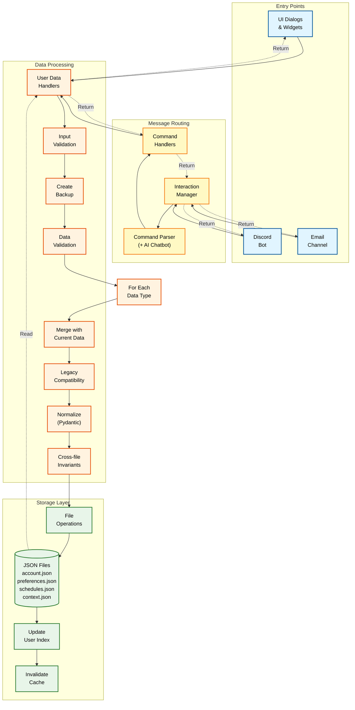

# MHM System Architecture

> **Audience**: Human developers building or maintaining the platform  
> **Purpose**: Explain system design, module responsibilities, and data flow  
> **Style**: Technical, detailed, reference-oriented  
> **Last Updated**: 2025-11-04

> **See [README.md](README.md) for complete navigation and project overview**  
> **See [AI_ARCHITECTURE.md](ai_development_docs/AI_ARCHITECTURE.md) for AI-optimized quick reference**  
> **See [ai/README.md](ai/README.md) for comprehensive AI system documentation**

## Quick Reference

### Key Module Decision Guide
1. **User data access** -> `core/user_data_handlers.py`, `core/user_data_validation.py`
2. **UI components** -> `ui/dialogs/`, `ui/widgets/`, `ui/ui_app_qt.py`
3. **Communication flows** -> `communication/`
4. **Scheduling and reminders** -> `core/scheduler.py`, `core/schedule_management.py`
5. **Configuration** -> `core/config.py`
6. **Testing utilities** -> `tests/` and `tests/logs/`

### Data Flow Overview
- **User Data**: `data/users/{user_id}/` -> `core/user_data_handlers.py` -> communication and UI layers.
- **Messages**: `resources/default_messages/` -> copied into `data/users/{user_id}/messages/` when a category is enabled.
- **Configuration**: `.env` -> `core/config.py` -> runtime components.
- **UI Rendering**: `.ui` files -> `ui/generated/` classes -> `ui/dialogs/` implementations -> `ui/ui_app_qt.py` shell.

### User Data Flow Diagram

The following diagram illustrates how user data flows through the system from entry points (UI, Discord, Email) through validation and processing to final storage:

**Detailed Flow Steps:**

1. **Entry Points**: 
   - **UI Dialogs/Widgets**: Call `save_user_data()` directly
   - **Discord/Email**: Send messages through channels

2. **Message Routing** (Discord/Email only):
   - **Interaction Manager**: Routes messages to appropriate handlers
   - **Command Parser**: Parses natural language using AI Chatbot for enhanced parsing
   - **Command Handlers**: Execute commands (task_handler, profile_handler, etc.)

3. **Data Processing**:
   - **Input Validation**: Validates user_id and data structure (once for all types)
   - **Backup Creation**: Creates backup before modifications (once for all types, if enabled)
   - **Data Validation**: Validates data against schema rules (once for all types)
   - **Per-Data-Type Loop**: The following steps run for each data type (account, preferences, schedules, etc.):
     - **Merge Current Data**: Merges updates with existing data from disk
     - **Legacy Compatibility**: Handles backward-compatible field mappings
     - **Normalization**: Applies Pydantic schema validation and normalization
     - **Cross-file Invariants**: Ensures consistency across related files (e.g., categories <-> schedules, automated_messages <-> account features)
     - **File Operations**: Writes validated data to JSON files

4. **Storage** (after loop completes):
   - **JSON Files**: All data types written to `data/users/{user_id}/` (account.json, preferences.json, schedules.json, context.json)
   - **Update Index**: Updates user index for fast lookup (once after all types saved)
   - **Invalidate Cache**: Clears cached data to ensure freshness (once after index update)

**Read Flow**: Data retrieval follows the reverse path - handlers read from files and return data to entry points (shown as dotted lines).

**Note**: The AI Chatbot is used internally by the Command Parser for AI-enhanced command parsing and contextual chat responses, not as a separate entry point.

### AI System Integration

The AI system (`ai/`) provides intelligent, context-aware responses and is integrated into the communication flow:
- **Entry Point**: Called by the Command Parser for enhanced parsing and contextual responses
- **Components**: `ai/chatbot.py` (main logic), `ai/prompt_manager.py` (prompts), `ai/cache_manager.py` (caching), `ai/lm_studio_manager.py` (LM Studio connection)
- **Context Building**: Uses `user/context_manager.py` to build comprehensive user context from user data
- **Fallback**: Falls back to contextual responses if LM Studio is unavailable
- **See**: [ai/README.md](ai/README.md) for detailed AI system architecture

### Critical Files
- `run_mhm.py` -> main entry point.
- `core/service.py` -> background service lifecycle.
- `ui/ui_app_qt.py` -> admin interface shell.
- `core/user_data_handlers.py` -> unified user data access.
- `communication/core/channel_orchestrator.py` -> channel coordination.

## Directory Overview

- **`core/`**: Business logic, services, scheduling, analytics, and configuration utilities.
- **`communication/`**: Channel orchestration (Discord, email, future integrations) and conversation flows.
- **`ui/`**: PySide6-based admin console with designs, generated code, dialogs, and widgets.
- **`data/`**: Runtime user data, per-user directories, logs, and cached state.
- **`resources/default_messages/`**: Template messages for onboarding and ongoing support.
- **`resources/`**: Additional presets, assets, and shared resources.
- **`ai/`**: Local AI integration modules.
- **`ai_development_docs/`**: AI-focused documentation for quick reference.
- **`ai_development_tools/`**: Automation for audits, documentation sync, and report generation.
- **`development_docs/`**: Human-focused references (changelog, dependencies, plans).
- **`scripts/`**: Utilities for migrations, cleanup, and maintenance tasks.
- **`tasks/`**: Task and reminder definitions plus supporting helpers.
- **`tests/`**: Unit, integration, behavior, and UI tests plus supporting fixtures.
- **`tests/logs/`**: Captured test run logs kept separate from runtime logs.
- **`styles/`**: QSS themes for the UI.
- **`.cursor/rules/`**: Cursor rule files that govern AI collaborator behaviour.

## User Data Model

Each user has a dedicated directory under `data/users/{user_id}/` containing:
- `account.json`: Identification and contact info.
- `preferences.json`: **Flat dictionary** of preferences (never nested under another key).
- `schedules.json`: Reminder and check-in scheduling data.
- `user_context.json`: Personalized context for messaging and interactions.
- `messages/`: Per-category message templates, copied from `resources/default_messages/` when enabled.
- `tasks/`, `checkins.json`, `chat_interactions.json`, and other feature-specific files as needed.

**Important rules**:
- All user data access goes through `core/user_data_handlers.get_user_data()` and associated save helpers.
- Message files are user-specific and created only for categories the user has enabled.
- When saving preferences, always write the full flat dictionary back to `preferences.json`.

## Data Handling Patterns

- Load, modify, and save complete structures to avoid partial writes.
- Use centralized validation in `core/user_data_validation.py` for consistency.
- Leverage `core/config.py` for paths and environment configuration-never hardcode paths.
- Schedule-related operations must respect the helper functions in `core/scheduler.py` and `core/schedule_management.py`.

## Key Modules and Responsibilities

- **`core/user_management.py`, `core/user_data_handlers.py`**: Unified data loading, merging, and saving.
- **`core/message_management.py`, `core/response_tracking.py`**: Message dispatch, tracking, and analytics.
- **`core/scheduler.py`, `core/service.py`**: Background task orchestration and service lifecycle.
- **`communication/core/channel_orchestrator.py`**: Central coordination of communication channels.
- **`ui/ui_app_qt.py`**: Admin application entry point and shell for dialogs/widgets.
- **`ui/dialogs/` and `ui/widgets/`**: Interactive UI components with business logic.
- **`ai_development_tools/`**: Audit workflows, documentation analysis, and changelog tooling.

## UI Architecture and Naming Conventions

- **Designs** (`ui/designs/`): `.ui` files authored in Qt Designer.
- **Generated** (`ui/generated/`): Auto-generated Python classes named `*_pyqt.py`.
- **Dialogs** (`ui/dialogs/`): Feature-specific modules such as `ui/dialogs/category_management_dialog.py`; keep descriptive names that use `_dialog` or `_management_dialog` suffixes.
- **Widgets** (`ui/widgets/`): Reusable components such as `ui/widgets/task_settings_widget.py`; use `_widget` or `_settings_widget` suffixes for clarity.
- **Naming**: Avoid redundant prefixes; rely on module paths for context.

### File Mapping Examples
| Purpose | Design | Generated | Implementation |
|---------|--------|-----------|----------------|
| Category management | `ui/designs/category_management_dialog.ui` | `ui/generated/category_management_dialog_pyqt.py` | `ui/dialogs/category_management_dialog.py` |
| Account creation | `ui/designs/account_creator_dialog.ui` | `ui/generated/account_creator_dialog_pyqt.py` | `ui/dialogs/account_creator_dialog.py` |
| Task settings | `ui/designs/task_settings_widget.ui` | `ui/generated/task_settings_widget_pyqt.py` | `ui/widgets/task_settings_widget.py` |

## Adding New Features Safely

1. Use `get_user_data()` helpers for all user data and extend the schema carefully.
2. Update preferences by reading and writing the full flat dictionary.
3. Document new message categories or files in `resources/default_messages/` and per-user directories.
4. Follow established naming conventions for UI additions and regenerate `.ui` files as needed.
5. Update this architecture file when introducing new subsystems or altering data flow.

## Development Notes

- When launching from VS Code or Cursor, two service processes may appear due to debugger behaviour; running from an activated PowerShell terminal avoids confusion.
- Keep architecture documentation synchronized with implementation changes-particularly when refactoring shared services or communication workflows.
