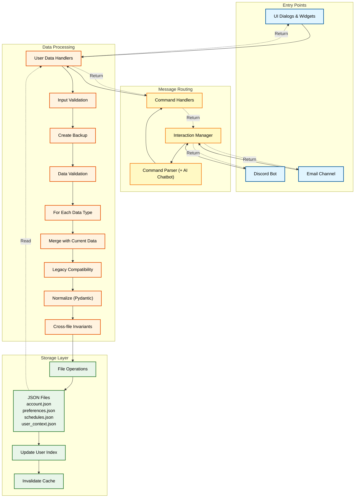

# MHM System Architecture

> **File**: `ARCHITECTURE.md`
> **Audience**: Human developers building or maintaining the platform  
> **Purpose**: Explain system design, module responsibilities, and data flow  
> **Style**: Technical, detailed, reference-oriented  
> **Pair**: [AI_ARCHITECTURE.md](ai_development_docs/AI_ARCHITECTURE.md)
> This document is paired with [AI_ARCHITECTURE.md](ai_development_docs/AI_ARCHITECTURE.md) and any changes must consider both docs.
> **Last Updated**: 2025-11-19

See [README.md](README.md) for navigation and project overview.  
See section 2. "Virtual Environment Best Practices" in [DEVELOPMENT_WORKFLOW.md](DEVELOPMENT_WORKFLOW.md) and section 1. "Quick Start (Recommended)" in [HOW_TO_RUN.md](HOW_TO_RUN.md) for environment setup and running the app.
For supporting details on logging, testing, and error handling, see:

- Section 2. Logging Architecture in [LOGGING_GUIDE.md](logs/LOGGING_GUIDE.md)  
- Section 2. "Test Layout and Types" in [TESTING_GUIDE.md](tests/TESTING_GUIDE.md)  
- Section 2. Architecture Overview in [ERROR_HANDLING_GUIDE.md](core/ERROR_HANDLING_GUIDE.md)  

---

## 1. Directory Overview

This section describes the top-level directories. It should match the actual project tree.

- `ai/`  
  AI integration modules, including optional LM Studio integration and local helpers for
  context building or summarization. See the "Overview" section in [SYSTEM_AI_GUIDE.md](ai/SYSTEM_AI_GUIDE.md)
  if present.

- `ai_development_docs/`  
  AI-focused documentation used by tools such as Cursor. These files are kept in sync at the
  H2 level with their human counterparts (for example `tests/TESTING_GUIDE.md`).

- `development_tools/`  
  AI tools runner and commands (for example `doc-sync`, `config`, `coverage`). These automate
  documentation checks, configuration reports, and similar meta-tasks. See section 2. Commands
  and Usage in [AI_DEVELOPMENT_TOOLS_GUIDE.md](development_tools/AI_DEVELOPMENT_TOOLS_GUIDE.md).

- `communication/`  
  Channel orchestration and message flows. This is where Discord, email, and any future channels
  are wired into the core service. Channel adapters should stay thin and delegate business logic
  to `core/` and `tasks/`. See section 2. Channel Layers and Boundaries in
  [COMMUNICATION_GUIDE.md](communication/COMMUNICATION_GUIDE.md).

- `core/`  
  Core business logic and services. Includes configuration loading, logging setup, error handling,
  the background service, schedulers, and user data helpers.

- `data/`  
  Per-user runtime data. The most important folder is `data/users/`, which contains one directory
  per user. Tests must not write here directly; they use `tests/data/` instead.

- `development_docs/`  
  Human-focused development documentation such as detailed changelog history and longer-term
  plans. See section 1. Overview in [CHANGELOG_DETAIL.md](development_docs/CHANGELOG_DETAIL.md) for change history.

- `logs/`  
  Application and component logs. See section 2. Logging Architecture in [LOGGING_GUIDE.md](logs/LOGGING_GUIDE.md)
  for the detailed logging scheme.

- `resources/`  
  Shared templates and assets. Message templates live under `resources/default_messages/` and are
  copied into user-specific folders the first time a category is enabled.

- `styles/`  
  QSS themes and styling assets for the admin UI.

- `tasks/`  
  Task and reminder definitions plus helpers for scheduling. This is where recurring work,
  reminder setup, and task orchestration live.

- `tests/`  
  Unit, integration, behavior, and UI tests plus fixtures. Test-only data lives under
  `tests/data/`. Logs from test runs may be collected under `tests/logs/`. See section 2.
  section 2. "Test Layout and Types" and section 3. "Fixtures, Utilities, and Safety" in [TESTING_GUIDE.md](tests/TESTING_GUIDE.md).

- `ui/`  
  PySide6 admin application:
  - `.ui` design files.  
  - Generated Python code created from `.ui`.  
  - Dialog and widget classes that connect generated code to real logic.  
  - The main shell in `ui/ui_app_qt.py` which connects UI components to the service.

- `user/`  
  Instance-level preferences and settings that apply to the whole installation, not just
  individual users under `data/users/`. This directory should change rarely and any new files
  must be documented explicitly.

If you add or remove top-level directories, update this section and the matching section in
[AI_ARCHITECTURE.md](ai_development_docs/AI_ARCHITECTURE.md).

---

## 2. User Data Model

Each user has a dedicated directory under `data/users/{user_id}/`. Typical contents include:

- `account.json`  
  Identification and contact information for the user (name, email, channel identifiers).

- `preferences.json`  
  Flat dictionary of preferences. There is no nested root key. All keys are top-level so they
  are easy to diff and edit.

- `schedules.json`  
  Reminder and check-in scheduling data. Encodes which time periods are active, how often messages
  are sent, and any category-specific overrides.

- `user_context.json`  
  Personalized context for messaging and interactions (health notes, motivational themes, other
  context that helps generate better messages).

- `messages/`  
  Per-category message templates copied from `resources/default_messages/` when the category is
  first enabled for this user. Users can customize or disable individual messages without
  touching the shared templates.

- Additional JSON files and subdirectories (for example `checkins.json`,
  `chat_interactions.json`, and other feature-specific artefacts) as features evolve.

Important rules:

1. All user data access goes through helpers in `core/user_data_handlers.py`.  
   Feature code should not open JSON files in `data/users/` directly. This keeps validation,
   backups, and migration logic centralized.

2. Preferences are always stored and loaded as a flat dictionary.  
   If you need nested structures at runtime, build them in memory. Avoid changing the on-disk
   layout without an explicit migration plan.

3. Message files are user-specific.  
   Template changes belong in `resources/default_messages/`. Per-user message changes belong in
   `data/users/{user_id}/messages/`.

4. New per-user files should follow a clear naming convention and be documented here.  
   Describe what they are for, how they are written, and which module owns them.

For more validation and schema details, see the relevant models and helpers in
`core/user_data_validation.py` and section 3. "Fixtures, Utilities, and Safety" in [TESTING_GUIDE.md](tests/TESTING_GUIDE.md).

### 2.1. User Data Flow Diagram

The diagram below shows how data flows from entry points (UI and channels) through validation
and processing to storage. This is adapted from the original architecture diagram.

Use this diagram when reasoning about where to add validation, backups, or legacy handling.

---

## 3. Data Handling Patterns

Data handling in MHM is designed around safety and clarity.

- Centralized user data access  
  - Use `get_user_data()` and related helpers in `core/user_data_handlers.py`.  
  - Keep raw file access inside these helpers or tightly related modules.

- Validation before write  
  - Use validation functions or models in `core/user_data_validation.py`.  
  - Reject or correct invalid data early and log clear errors.

- Backups on risky operations  
  - Before major migrations or schema changes, create backups of the user directory or
    specific files.  
  - Backups should live in a predictable location (for example under `data/backups/`) and be
    mentioned in logs.

- Clear separation of template and instance data  
  - Shared templates live under `resources/default_messages/`.  
  - User-specific instances live under `data/users/{user_id}/messages/` and are safe to edit
    per user.

- Legacy compatibility and migration  
  - When you need to support an old on-disk format, add a clearly marked legacy path.  
  - Use the legacy compatibility logging pattern described in section 7. "Legacy Compatibility Logging Standard" in [LOGGING_GUIDE.md](logs/LOGGING_GUIDE.md).

When adding new data or changing existing structures:

1. Decide whether the data is per-user or global.  
2. Decide whether it belongs under `data/users/` or `resources/`. Only use `user/` for
   instance-level configuration that truly applies to the whole installation.  
3. Add validation logic and tests (see section 6. "Writing and Extending Tests" in
   [TESTING_GUIDE.md](tests/TESTING_GUIDE.md)).  
4. Document the new files here and in any relevant guides.

---

## 4. Key Modules and Responsibilities

This section summarizes the most important modules and how they relate. It is not a complete
listing of every file.

- `run_mhm.py`  
  Entry point for the admin UI. Prepares the Python interpreter path, sets up environment
  context, and launches the PySide6 application defined in `ui/ui_app_qt.py`.

- `run_headless_service.py` and `core/headless_service.py`  
  Command-line entry point and manager for the background service without the UI. Responsible
  for starting, stopping, and inspecting the service while avoiding conflicts with the UI.

- `core/service.py`  
  Main service implementation. Owns the lifetime of the background processes that send
  reminders, handle scheduling, and coordinate with communication components.

- `core/config.py`  
  Central configuration loader. Reads environment variables (typically from `.env` via
  `python-dotenv`), validates them, and exposes configuration to the rest of the system.
  For configuration details and validation patterns, see section 5. Configuration
  (Environment Variables) in [LOGGING_GUIDE.md](logs/LOGGING_GUIDE.md).

- `core/logger.py`  
  Central logging setup. Provides component loggers and attaches handlers to the
  appropriate log files under `logs/`. For log levels, file layout, and rotation rules,
  see section 2. Logging Architecture and section 4. Component Log Files and Layout in
  [LOGGING_GUIDE.md](logs/LOGGING_GUIDE.md).

- `core/error_handling.py`  
  Shared error handling logic and decorators. Connects error handling to logging and, where
  applicable, to basic metrics. For the broader design and patterns, see section 2.
  Architecture Overview in [ERROR_HANDLING_GUIDE.md](core/ERROR_HANDLING_GUIDE.md).

- `core/user_data_handlers.py` and `core/user_data_validation.py`  
  Read and write user data in a safe and consistent way, with validation and optional
  migration paths. See section 2. User Data Model and section 3. Data Handling Patterns
  in this file.

- `communication/` modules  
  Implement and coordinate channels such as Discord and email. Channel modules should
  focus on translating service events into channel-specific calls and delegating shared
  logic to `core/` and `tasks/`. See section 1. Core Principle in
  [COMMUNICATION_GUIDE.md](communication/COMMUNICATION_GUIDE.md).

- `tasks/` modules  
  Define recurring tasks and reminder logic. These modules are wired into the scheduler
  and the service loop to send messages and perform periodic maintenance.

- `ui/ui_app_qt.py`  
  Top-level PySide6 application shell. Connects dialogs and widgets to the backend service,
  handles app-level configuration, and exposes operations like starting and stopping the
  service from the UI.

When making changes, prefer updating one layer at a time and keep clear boundaries between
core logic, UI, and channels. For test strategy around these modules, see section 3.

---

## 5. UI Architecture and Naming Conventions

The UI follows a consistent pattern so that designs, generated code, and dialogs remain in sync.

Typical structure:

- `ui/designs/`  
  Raw `.ui` files created with Qt Designer. These define layout and widgets but no business
  logic.

- `ui/generated/` (or similar)  
  Generated Python code produced from `.ui` files. These files are not edited by hand.
  Manual changes will be lost when regenerating.

- `ui/dialogs/`  
  Dialog classes that inherit from the generated forms. Business logic, signal connections,
  and service integration live here.

- `ui/widgets/`  
  Reusable widgets that can be embedded into multiple dialogs or views. They also inherit
  from generated forms where appropriate.

- `ui/ui_app_qt.py`  
  Application entry shell. Sets up the main window, wires menus and navigation, and connects
  actions to dialogs and service operations.

Naming conventions:

- Dialog design: `something_dialog.ui`  
- Dialog generated: `something_dialog_pyqt.py` (or similar)  
- Dialog implementation: `ui/dialogs/something_dialog.py` with class `SomethingDialog`

- Widget design: `something_widget.ui`  
- Widget generated: `something_widget_pyqt.py`  
- Widget implementation: `ui/widgets/something_widget.py` with class `SomethingWidget`

The goal is that when you see a dialog in the UI, you can easily find:

1. The `.ui` design file.  
2. The generated form.  
3. The implementation that attaches behavior.

If you add new dialogs or widgets, follow the same pattern. Only update this section if you
introduce a new convention. For UI testing and manual QA, see section 8. "Manual and Channel-Specific Testing Overview" in [TESTING_GUIDE.md](tests/TESTING_GUIDE.md).

---

## 6. Channel-Agnostic Architecture

MHM is designed so that most business logic is channel-agnostic.

- Business logic and data handling live in `core/` and `tasks/`.  
- Channel adapters in `communication/` translate between service events and channel-specific
  APIs (Discord, email, and future channels).  
- UI components in `ui/` act as another adapter layer, turning user actions into calls into
  `core/` and `tasks/`.

When implementing new features or channels:

1. Put shared behavior in `core/` or `tasks/` when possible.  
2. Keep `communication/` modules focused on translating events and payloads, not business rules.  
3. Use the patterns and examples in section 2. Channel Layers and Boundaries in
   [COMMUNICATION_GUIDE.md](communication/COMMUNICATION_GUIDE.md).  

This separation keeps features reusable across channels and reduces the risk of subtle behavior
differences between Discord, email, and the UI.

---

## 7. Development Notes

- Avoid running multiple service instances.  
  When using an IDE like VS Code or Cursor, it is easy to accidentally start the service twice.
  Prefer running `python run_mhm.py` or `python run_headless_service.py start` from an activated
  terminal and verify with the `status` command.

- Keep docs and code in sync.  
  Whenever you add or remove major modules, update this file and the matching
  [AI_ARCHITECTURE.md](ai_development_docs/AI_ARCHITECTURE.md). Use the documentation sync checker to enforce H2
  alignment between paired docs.

- Use established logging and error handling patterns.  
  Prefer `core/logger.py` and `core/error_handling.py` plus the guidance in section 2.
  Logging Architecture in [LOGGING_GUIDE.md](logs/LOGGING_GUIDE.md) and section 2. Architecture Overview in
  [ERROR_HANDLING_GUIDE.md](core/ERROR_HANDLING_GUIDE.md) instead of ad-hoc prints or try/except blocks.

- Learn by small steps.  
  The architecture is built to support safe, incremental changes. Make one change at a time,
  observe its impact, and use logging and tests to confirm behavior. For overall development
  process, see section 2. "Standards and Templates" in [DOCUMENTATION_GUIDE.md](DOCUMENTATION_GUIDE.md).
