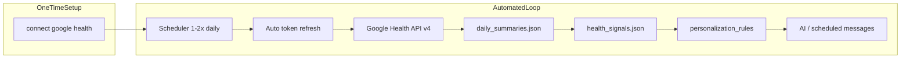

# Health Integration Plan

> **File**: `development_docs/HEALTH_INTEGRATION_PLAN.md`  
> **Status**: V0 **COMPLETED** — V1 product backlog **COMPLETED** (2026-06-28); monitoring live behavior  
> **Shipped**: 2026-06-27  
> **Developer guide**: [integrations/google_health/GOOGLE_HEALTH_GUIDE.md](../integrations/google_health/GOOGLE_HEALTH_GUIDE.md)  
> **Parent index**: [PLANS.md](PLANS.md) (Google Health row → **COMPLETED**)

## Goal (unchanged)

Read-only Google Health / Fitbit wellness data for **gentle message personalization only** — not clinical or diagnostic use. After a **one-time OAuth connect**, sync and token refresh run automatically; users do not need daily manual steps.

Example tone (via derived guidance, not raw metrics):

- “You may be under-recovered today — keep expectations smaller.”
- “Recent rest looks solid; a light walk could feel good if you want movement.”

---

## Architecture summary

| Layer | Location | Role |
|-------|----------|------|
| External API + OAuth | `integrations/google_health/` | Read-only fetch, sync, signals, rules |
| Public API | `core/health_signals.py`, `core/health_context_builder.py` | Channel-agnostic guidance for AI and orchestrator |
| Storage | `data/users/{user_id}/health/` | Auth, summaries, signals, sync state ([USER_DATA_MODEL.md](../core/USER_DATA_MODEL.md) §2.3.5) |
| Automation | `scheduler/health_sync_jobs.py` | Polls every 30 min; sync when user's local `GOOGLE_HEALTH_SYNC_TIMES` slot is due (`account.timezone`) |
| Commands | `communication/command_handlers/health_handler.py` | Connect, status, pause, enable, delete, debug sync |
| Admin UI | `ui/dialogs/google_health_settings_dialog.py` | Connect panel (same OAuth flow as Discord) |
| Feature flag | `account.features.google_health` | `enabled` \| `disabled` \| `paused` |

**API:** [Google Health API](https://developers.google.com/health/migration) (`health.googleapis.com/v4/`) — **not** legacy Fitbit Web API.

**Scopes (read-only):** `googlehealth.sleep.readonly`, `googlehealth.activity_and_fitness.readonly`, `googlehealth.health_metrics_and_measurements.readonly`. Do **not** use `include_granted_scopes=true`.

---

## Per-user data files

| File | Purpose |
|------|---------|
| `google_health_auth.json` | OAuth tokens (**sensitive**) |
| `daily_summaries.json` | Normalized daily metrics (sleep, steps, HR, HRV, active minutes) |
| `health_signals.json` | Derived signals + `message_guidance` tokens |
| `sync_state.json` | Last sync, errors, failure count, baseline metadata |

Backups: `health/` is included automatically — `backup_user_data()` zips the full `data/users/{user_id}/` tree.

---

## Phased implementation (original plan)

| Phase | Scope | Status |
|-------|--------|--------|
| **0** | Package scaffold, schemas, `data_handlers`, config validation, `FeaturesV2Model`, USER_DATA_MODEL | ✅ Done |
| **1** | One-time OAuth (localhost callback), token refresh, auto first sync on connect | ✅ Done |
| **2** | API client, `sync_manager`, scheduler jobs, `daily_summaries` | ✅ Done |
| **3** | `signal_builder`, baselines, confidence, `core/health_signals.py` | ✅ Done |
| **4** | `personalization_rules.py`, scheduled-message hook in `channel_orchestrator` | ✅ Done |
| **5** | `health_context_builder.py`, `append_health_guidance`, AI instruction guardrails | ✅ Done |
| **6** | Discord commands (connect / status / pause / enable / delete / sync) | ✅ Done (Discord); admin UI connect panel ✅ Done 2026-06-28 |
| **7** | Failure auto-pause, corrupt JSON recovery, tests, docs | ✅ Done |

### Post-ship fixes (2026-06-27, same session)

Live testing exposed API client issues; fixed in `integrations/google_health/client.py`:

1. **Kebab-case endpoints** — e.g. `daily-resting-heart-rate` not `dailyRestingHeartRate`
2. **Type-specific list filters** — `sleep.interval.end_time`, `steps.interval.start_time`, `daily_*.date`
3. **Pagination** — follow `nextPageToken`
4. **Response parsing** — `civilStartTime.date`, `beatsPerMinute`, `averageHeartRateVariabilityMilliseconds`, `activeZoneMinutes`; completeness only when values parse

---

## V0 deliverables checklist

| Item | Status |
|------|--------|
| `integrations/google_health/` package (auth, client, sync, signals, rules, data_handlers) | ✅ |
| `core/health_signals.py`, `core/health_context_builder.py` | ✅ |
| `scheduler/health_sync_jobs.py` registered from `scheduler/jobs.py` | ✅ |
| Config + `.env.example` + `CONFIGURATION_REFERENCE.md` | ✅ |
| `FeaturesV2Model.google_health` | ✅ |
| Discord commands + parser intents | ✅ |
| Exclude health intents from `response_enhancer` | ✅ |
| Auto-pause after `GOOGLE_HEALTH_SYNC_FAILURE_PAUSE_THRESHOLD` failures | ✅ |
| Dev manual sync: `python -m integrations.google_health.sync_manager --user-id ID` | ✅ |
| Unit / behavior / integration tests (`tests/unit/test_google_health_*`, `test_health_*`, etc.) | ✅ |
| Architecture + changelog + `GOOGLE_HEALTH_GUIDE.md` | ✅ |
| `google-auth` / `google-auth-oauthlib` in `requirements.txt` | ✅ |
| Live single-user validation (OAuth, sync, populated summaries) | ✅ |

---

## Live validation notes (Julie install, 2026-06-27)

- OAuth connect + automated sync working
- `daily_summaries.json`: sleep, steps, resting HR, HRV, active minutes populated for recent days
- `health_signals.json`: sleep recovery + activity level populated; HR/HRV **comparison signals** still `unknown` until ≥7 days of history for baselines
- `message_guidance` empty while `confidence: low` — **expected** per design (rules require medium+ confidence)
- Scheduler sync ~1 min per run (480 step intervals paginated) — acceptable for V0; see optional optimizations below

---

## Outstanding / deferred work

### V1 — product & UX

| Item | Priority | Notes |
|------|----------|-------|
| **Admin UI connect panel** | Medium | ✅ Shipped 2026-06-28 — **Google Health** button on admin panel; [`google_health_settings_dialog.py`](../ui/dialogs/google_health_settings_dialog.py) + shared [`user_settings.py`](../integrations/google_health/user_settings.py) |
| **Admin UI “Sync now”** | Low | Debug via Discord `sync health` or CLI module |
| **Per-user timezone sync times** | Medium | ✅ Shipped 2026-06-28 — `GOOGLE_HEALTH_SYNC_TIMES` interpreted in `account.timezone`; 30-min poll via `scheduler/health_sync_schedule.py`; `sync_state.last_scheduled_slot` dedupes per slot |
| **`preferences.json` → `health_personalization`** | Low | Plan open question: `{ use_in_messages, use_in_chat }` — deferred; V0 uses account feature flag only |
| **Reconnect user notification** | Medium | ✅ Shipped 2026-06-28 — one low-key channel message when auto-pause follows auth/token failures; `sync_state.reconnect_notice_sent` dedupes until next successful sync |
| **`getIdentity` on connect** | Low | Populate `google_health_auth.json` → `google_user_id` for forward compatibility |

### V1 — security & scale

| Item | Priority | Notes |
|------|----------|-------|
| **Token encryption at rest** | Medium | ✅ Shipped 2026-06-28 — optional `GOOGLE_HEALTH_TOKEN_ENCRYPTION_KEY` (Fernet); `tokens_encrypted` on auth file; plaintext migrates on next save |
| **Google OAuth verification** | Low | Required only for public app / >100 users; Testing mode + test users sufficient for personal MHM |

### V1 — performance & API (optional)

| Item | Priority | Notes |
|------|----------|-------|
| **Steps `dailyRollUp` endpoint** | ✅ Shipped 2026-06-27 | Used for steps + active-zone-minutes; chunked list fallback |
| **Upsert field merge** | ✅ Shipped 2026-06-27 | Partial sync no longer wipes steps when activity API fails |
| **Larger `pageSize` for non-sleep types** | Low | Reduce pagination round-trips |
| **Configurable baseline window** | Low | Today hard-coded 7/14-day thresholds in `signal_builder.py` |

### Documentation gaps (non-blocking)

| Item | Notes |
|------|-------|
| `tests/TESTING_GUIDE.md` — Google Health mock section | Plan listed; not added yet |
| `ai/SYSTEM_AI_GUIDE.md` — health guidance in context assembly | Plan listed; detail lives in `health_context_builder` + changelogs |

---

## Monitoring (no code required yet)

- [ ] **7–14 days of sync history** — confirm `confidence` rises to `medium`/`high` and `message_guidance` populates
- [ ] **HR/HRV baseline signals** — confirm `resting_hr_signal` / `hrv_signal` leave `unknown` once enough days exist
- [ ] **Scheduled message tone** — observe scheduled sends with guidance prefix in logs (no raw metrics to user)
- [ ] **Auth failure path** — if refresh fails, confirm auto-pause and reconnect notice delivery (one-time message on primary channel)
- [ ] **Automated scheduler runs** — confirm morning/evening sync entries in `logs/google_health.log` at user's local `GOOGLE_HEALTH_SYNC_TIMES` (poll every 30 min)

**Operational tip:** Increase `GOOGLE_HEALTH_SYNC_LOOKBACK_DAYS` (default `3`) temporarily to backfill more history for baselines faster.

---

## Safety constraints (enforced in V0)

| Concern | Mitigation |
|---------|------------|
| Clinical claims | Rules + AI instructions; no diagnosis language |
| Raw metrics in AI | `health_context_builder` — guidance phrases only |
| Token leakage | Never log token values; auth file in gitignored `data/`; optional Fernet encryption via `GOOGLE_HEALTH_TOKEN_ENCRYPTION_KEY` |
| API failure | Silent fallback to normal messages; auto-pause after repeated failures |
| User control | `pause health`, `enable health`, `delete health data` |
| Testing | `MHM_TESTING=1` skips live API calls |

---

## Commands reference

| Command | Purpose |
|---------|---------|
| `connect google health` | One-time OAuth (Discord or admin UI **Google Health** button) |
| `health status` | Connection + last sync |
| `pause health` / `enable health` | Stop / resume sync and personalization |
| `delete health data` | Wipe local `health/` files |
| `sync health` | Debug manual sync only |

---

## Test coverage map

| Test file | Covers |
|-----------|--------|
| `tests/unit/test_google_health_config.py` | Config validation |
| `tests/unit/test_google_health_auth.py` | OAuth URL, token refresh |
| `tests/unit/test_google_health_client.py` | API filters, parsing, merge |
| `tests/unit/test_google_health_sync_manager.py` | Sync orchestration, upsert |
| `tests/unit/test_google_health_data_handlers.py` | On-disk I/O, corrupt recovery |
| `tests/unit/test_health_signal_builder.py` | Baselines, confidence |
| `tests/unit/test_health_personalization_rules.py` | Rule matrix |
| `tests/unit/test_health_context_builder.py` | AI-safe context |
| `tests/unit/test_google_health_notifications.py` | Reconnect notice on auth auto-pause |
| `tests/unit/test_google_health_token_crypto.py` | Fernet token encryption at rest |
| `tests/unit/test_health_sync_schedule.py` | Per-user timezone slot due logic |
| `tests/unit/test_google_health_user_settings.py` | Shared connect/status/settings ops |
| `tests/behavior/test_health_handler_behavior.py` | Commands |
| `tests/integration/test_health_scheduler_job.py` | Scheduler registration |

Fixtures: `tests/test_helpers/fixtures/google_health/`

---

## Related docs

- [GOOGLE_HEALTH_GUIDE.md](../integrations/google_health/GOOGLE_HEALTH_GUIDE.md) — OAuth setup, troubleshooting
- [USER_DATA_MODEL.md](../core/USER_DATA_MODEL.md) §2.3.5 — storage schema
- [CONFIGURATION_REFERENCE.md](../CONFIGURATION_REFERENCE.md) — env vars
- [ARCHITECTURE.md](../ARCHITECTURE.md) / [AI_ARCHITECTURE.md](../ai_development_docs/AI_ARCHITECTURE.md) — `integrations/` convention
- Changelog: [CHANGELOG_DETAIL.md](CHANGELOG_DETAIL.md) / [AI_CHANGELOG.md](../ai_development_docs/AI_CHANGELOG.md) — 2026-06-27 entry

---

## Open decisions (from original plan — resolved or deferred)

| # | Question | Decision |
|---|----------|----------|
| 1 | GCP project setup | **Testing mode + test users** — sufficient for personal MHM; document in GOOGLE_HEALTH_GUIDE |
| 2 | `health_personalization` preferences envelope | **Deferred** — account `features.google_health` only in V0 |
| 3 | Per-user timezone for sync | **Shipped 2026-06-28** — account timezone via `scheduler/user_timezone.py`; poll + slot dedupe |
| 4 | Admin UI vs Discord connect | **Shipped 2026-06-28** — admin **Google Health** panel + Discord/localhost callback |
| 5 | Google Health API endpoint names | **Resolved** during live testing — kebab-case paths + type-specific filters |

---

## Risks (ongoing)

| Risk | Mitigation |
|------|------------|
| Google restricted-scope verification | Stay in Testing mode for personal use |
| Refresh token loss / 6-month idle expiry | Auto-pause; one-time reconnect notice; reconnect via `connect google health` |
| Mixed OAuth scopes break API | Never `include_granted_scopes`; only `googlehealth.*` |
| Sparse baseline data | Require min history; `unknown` + normal messages until confident |
| Sync latency (many step intervals) | Mitigated via `dailyRollUp`; chunked list fallback if rollUp fails |
